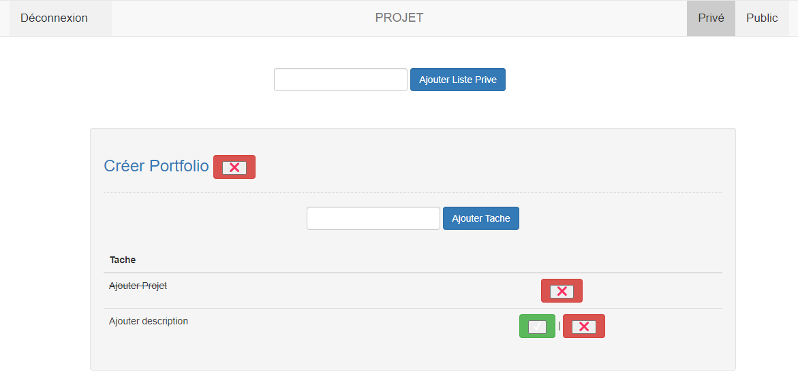

<h1 align="center"> ToDoList 👋</h1>

> Application web de ToDoList en langage PHP, avec comme support bootstrap et base de donnée SQL.

### 🏠 [Homepage](https://github.com/Benjamin158/php-todo-app)

## 📍 Prérequis

- PHP 7.0~8.1
- Apache 2
- MySQL, PHPMyAdmin
- Editeur PHP
- Serveur Web

## ✏️ Auteur

👤 **VALLEIX Benjamin**

* Github: [@B3njaminV](https://github.com/B3njaminV)
* LinkedIn: [@Benjamin VALLEIX](https://www.linkedin.com/in/benjamin-valleix-27115719a)

👤 **MARTIN Vincent**

* Github: [@VincentMart](https://github.com/VincentMart)

## 🤝 Base de donnée SQL

Vous pourrez trouver notre Base de Donnée dans le fichier `localhost.sql` et l'importer sur votre prore Base de donnée

- N'oubliez pas de changer les valeurs de `$user` `$pass` dans `Connection.php`avant de vous connecter à la base de donnée 

## 📝 License

Copyright © 2021.

## 🛠 Languages

 
     
	 
	

